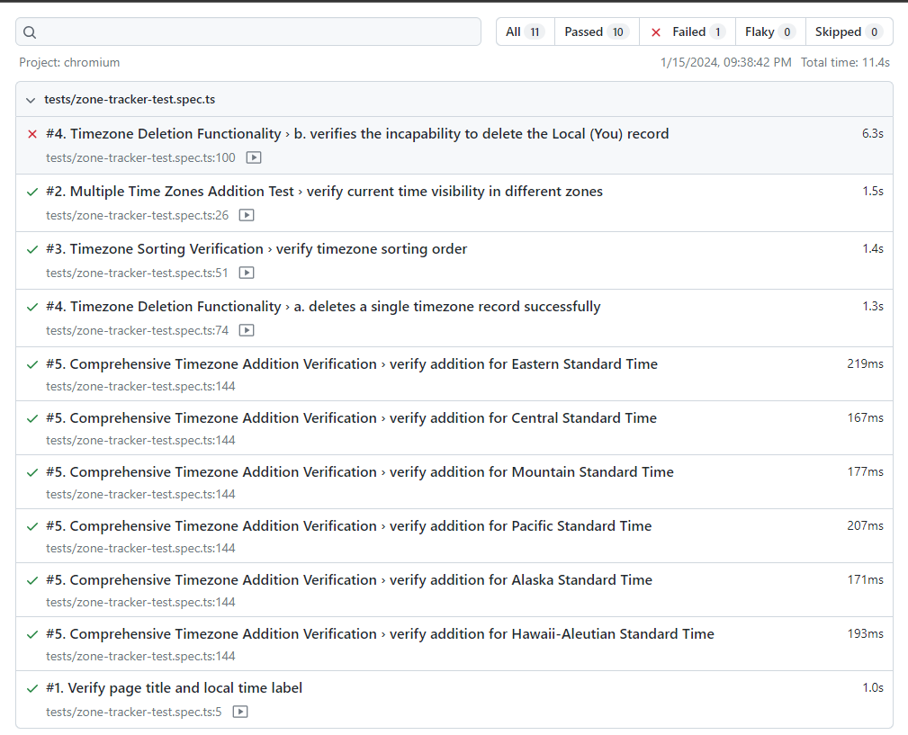

This is a [Next.js](https://nextjs.org/) project bootstrapped with [`create-next-app`](https://github.com/vercel/next.js/tree/canary/packages/create-next-app).

## Getting Started

First, run the development server:

```bash
npm run dev
# or
yarn dev
# or
pnpm dev
```

Open [http://localhost:3000](http://localhost:3000) with your browser to see the result.

You can start editing the page by modifying `app/page.tsx`. The page auto-updates as you edit the file.

This project uses [`next/font`](https://nextjs.org/docs/basic-features/font-optimization) to automatically optimize and load Inter, a custom Google Font.

## Testing

To run tests, ensure that the development server is running in background. Then, run `npm run e2e` or `yarn e2e` to execute tests. If this is your first time running Playwright tests, you should run `npx playwright install` or `yarn playwright install` to install browser binaries.

# Playwright Testing Project:

## Description
This project uses Playwright for end-to-end testing of a web application. It includes a suite of tests to ensure the functionality of the Zone Tracker application, which tracks and displays time zones.

## Installation Guidelines

### Prerequisites
- Node.js (version 12 or later)
- A package manager like npm or yarn

### Setup
- Clone the project
- Install dependencies using npm install
- Run the project using npm run dev
- Start testing: npx playwright test

### Summary of Test Cases

- **Test Case 1**: Has Title & has 'Local You' Label
Verifies that the application correctly displays its title and labels the user's local timezone as 'Local(You)'.

- **Test Case 2**: Verifies User is able to Add Multiple Time Zones
Tests the functionality for users to add multiple time zones, ensuring the application can handle and display multiple zones simultaneously.

- **Test Case 3**: Sorting of Timezones
Checks the application's ability to correctly sort time zones, ensuring they are displayed in the intended order.

- **Test Case 4**: Timezone Records Deleted Successfully
Validates that the application correctly allows users to delete timezone records and updates its display accordingly.

- **Test Case 5**: Verify Addition of Various Timezones
Confirms that the application can handle the addition of a variety of different time zones, ensuring robustness and flexibility in handling timezone data.

## Output

